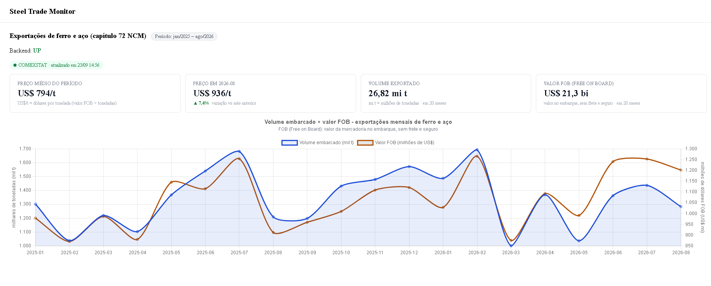

# Steel Trade Monitor

[](https://github.com/LealDev/steel-trade-monitor/actions/workflows/ci-cd.yml)

**🔗 Ao vivo: [steel.lealdev.com.br](https://steel.lealdev.com.br)**

Monitor de comércio exterior de aço brasileiro: coleta dados públicos do
[Comex Stat/MDIC](https://comexstat.mdic.gov.br), armazena em modelo dimensional
próprio e expõe análises via API REST consumida por um dashboard Angular.
Dados reais, pipeline diário automatizado, rodando em produção.



## Para quem é

O tipo de análise que este painel entrega — volume embarcado, valor FOB e
preço médio US$/t das exportações de ferro e aço (capítulo 72 NCM) — é o
feijão-com-arroz de áreas comerciais de siderúrgicas, tradings de commodities,
operadores logísticos (portos/ferrovias) e analistas que cobrem o setor na
bolsa. Trabalho com sistemas de logística industrial nesse setor; este projeto
é a versão pública dos problemas que resolvo no dia a dia: integração com
fontes instáveis, modelagem analítica, idempotência e operação.

## Arquitetura

```
Comex Stat (MDIC) ──HTTP──► INGESTÃO ──payload cru──► STAGING (JSONB)
                    retry ·  (porta/adaptador)              │ transforma
                    circuit breaker                         ▼
                                                   MODELO DIMENSIONAL
                                                   (star schema, upsert
                                                    idempotente)
                                                            │ GROUP BY
                                                            ▼
Angular (Chart.js) ◄──JSON── API REST (/api/v1) ◄── consultas agregadas
```

Decisões centrais (detalhadas em [`arquitetura-steel-trade-monitor.md`](arquitetura-steel-trade-monitor.md)):

- **ELT com staging**: o payload cru é persistido antes de qualquer
  transformação — reprocessamento sem gastar cota da fonte e auditoria
  completa ("o MDIC mandou isso, eu transformei naquilo").
- **Star schema** com grão explícito: uma linha do fato = um mês, um NCM,
  um país, uma UF, uma via de transporte, um fluxo.
- **Idempotência por upsert na chave natural**: rodar o pipeline duas vezes
  não altera nenhum número — é o teste mais importante do projeto.
- **Anti-corruption layer**: nomes de campo da fonte (`coNcm`, `metricFOB`)
  morrem na fronteira; o domínio interno não os conhece.
- **Resiliência**: retry com backoff exponencial + jitter (calibrado no rate
  limit real da fonte, ~1 req/10s) e circuit breaker — 429 não abre o
  circuito, cota estourada não é fonte caída.
- **Toda execução registrada**: watermark, volumetria e status por rodada
  alimentam o endpoint de freshness e o badge "atualizado em" do dashboard.

## Stack

| Camada | Tecnologia |
|---|---|
| Backend | Java 25 · Spring Boot 4 · JPA/Hibernate · Flyway · Resilience4j |
| Banco | PostgreSQL 17 (JSONB na staging, star schema no warehouse) |
| Frontend | Angular 20 (standalone + signals) · Chart.js |
| Testes | JUnit 5 · Mockito · Testcontainers · MockMvc · Karma/Jasmine |
| Operação | Docker Compose · Caddy (HTTPS automático) · GitHub Actions (CI/CD) |

## Rodando localmente

Pré-requisitos: Docker, JDK 25, Node 22.

```bash
# 1. Banco
docker compose up -d

# 2. API (porta 8080) — aplica as migrations e expõe /api/swagger-ui.html
cd Backend/steel-trade-api && ./mvnw spring-boot:run

# 3. Front (porta 4200, proxy /api → 8080)
cd Frontend/steel-trade-monitor-web && npm ci && npx ng serve

# 4. Primeira carga de dados (mês a mês — a fonte trunca janelas longas)
curl -X POST localhost:8080/api/v1/ingestion/comexstat/runs \
  -H "Content-Type: application/json" \
  -d '{"from":"2026-06","to":"2026-06","chapter":72}'
```

Testes: `./mvnw test` (backend — os de integração usam Testcontainers) e
`npx ng test` (frontend).

## CI/CD

- **`develop`** (dia a dia): cada push roda a suíte completa dos dois lados.
- **`main`** (produção): push → testes → build → deploy automático na VPS
  (rsync + rebuild do container + health check). Chave SSH dedicada em
  Secrets, host key fixado.

## Status do roadmap

- [x] **Fase 0** — esqueleto (Spring Boot + Postgres/Flyway + Angular)
- [x] **Fase 1** — pipeline Comex Stat ponta a ponta com dados reais
- [x] **Fase 2** — confiabilidade: retry, circuit breaker, execuções
      registradas, freshness
- [x] **Deploy** — produção na VPS com CI/CD
- [ ] **Fase 3** — importação, capítulo 73, rankings, Trade Explorer
- [ ] **Fase 4** — câmbio/cotações ao vivo (SSE), cache
- [ ] **Fase 5** — export CSV, acabamento
